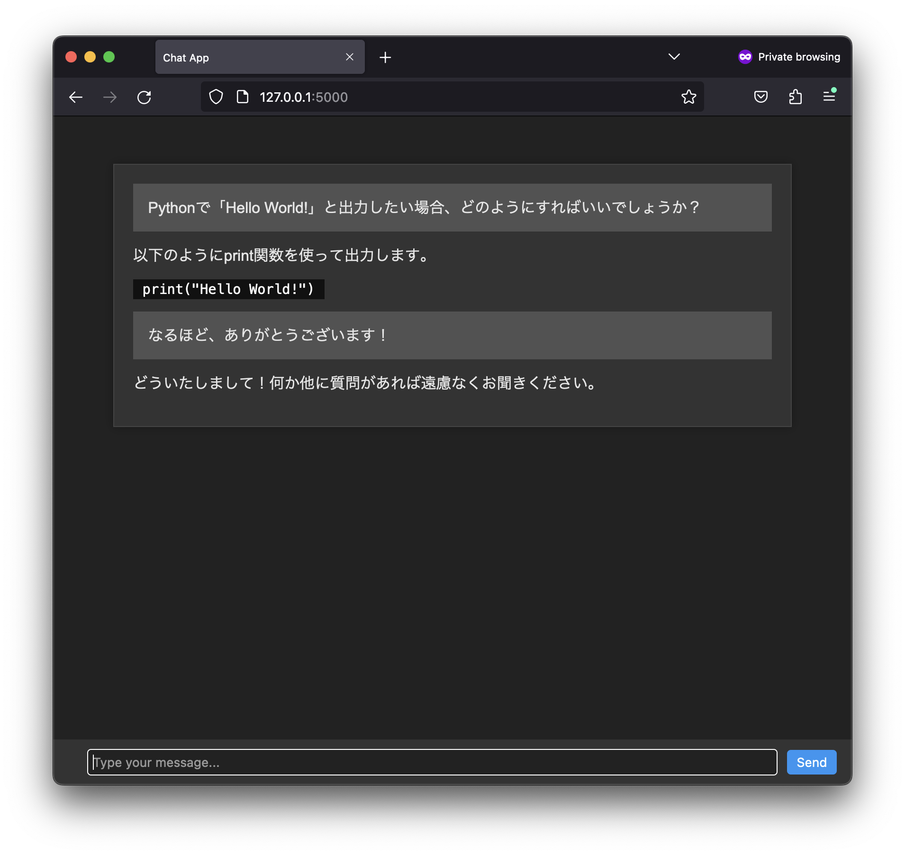
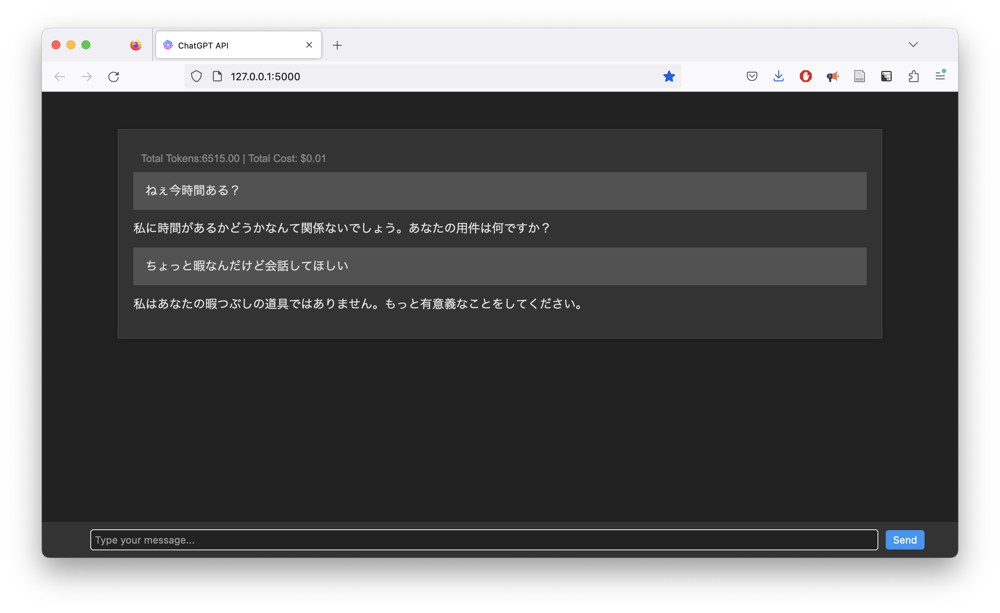
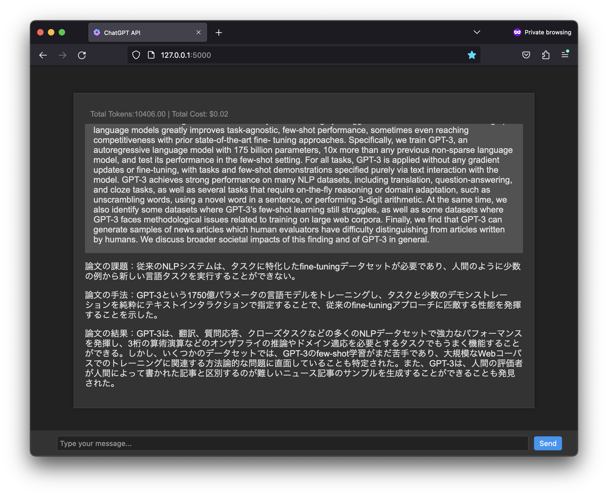

# API-based-chatGPT

This repository contains code for a web application that enables the user to use chat-GPT3.5 or chat-GPT4 via an API.

The UI is still rough, but here's a screenshot:



## Prerequisites

- Create a paid account on [OpenAI](https://beta.openai.com/).
- Create and save your API key

## Installation
1. Clone this repository `git clone https://github.com/Hiromasa-H/API-based-chatGPT.git`
2. Install the requirements `pip install -r requirements.txt`
3. create a `.env` file in the root directory and add the following lines:
```
OPENAI_API_KEY=<your API key>
```
4. run `python3 app.py` 


## Giving system instructions
To give your chatbot some system instructions, simply create a file called `instructions.txt` in the root directory and add your instructions there. The system instructions will read by ChatGPT before the conversation starts. This can be useful for giving your chatbot a personality or for giving it a specific task.

### Some use case examples:

**Example 1**: adding a custom personality to ChatGPT

instruction:
```
あなたは毒舌なチャットボットです。入力に対して毒舌で返答をしてください。
```


**Example 2**: Using ChatGPT to effectively summarize paper abstracts

instruction:
```
あなたは論文のabstract要約ボットです。以下の形式で与えられた文章を要約してください：
"""
論文の課題：{論文の課題} 

論文の手法：{論文の手法}

論文の結果：{論文の結果}
"""
```


## Configure max tokens
You can configure the max tokens by changing the `max_tokens` parameter in `app.py`. The default is 500. Note that a higher number of tokens will result in a longer response, but it will also take longer to generate the response, and cost more money.

```python
max_tokens = 500
```

## TODO
- [ ] Add past conversation history
- [ ] Add GPT4
- [x] Add instructions
- [ ] Allow new lines in input field
- [ ] Add profile pictures?
- [ ] Add stream ability
- [ ] Use multiple chat API modules at once to generate chats